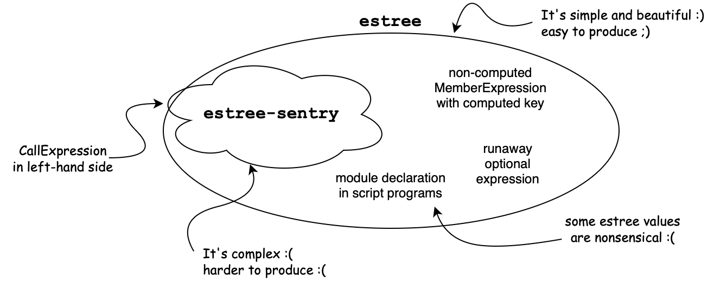

# estree-sentry

More precise [estree](https://github.com/estree/estree) type with support for
generic annotations.



[estree](https://github.com/estree/estree) and its typescript type definition
[@types/estree](https://www.npmjs.com/package/@types/estree) are great but many
valid `estree.Program` are nonsensical and consumers do not benefit from the
typescript type system as much as they could. For instance, the key of a
non-computed member expression can be an arbitrary expression but only an
identifier or a private identifier would be sensible. This forces consumers to
backdoor the type system with ugly type assertions such as the
`as Identifier | PrivateIdentifier` below:

```typescript
import { MemberExpression, Identifier, PrivateIdentifier } from "estree";
export const getNonComputedKey = (node: MemberExpression): string | null =>
  node.computed ? null : (node.property as Identifier | PrivateIdentifier).name;
```

`estree-sentry` is a subset of `estree` (safe call expression in left-hand side
of assignments) which removes many nonsensical nodes at the price of more
complex type definitions. This makes nodes easier to consume (but harder to
produce).

```typescript
import { MemberExpression } from "estree-sentry";
export const getNonComputedKey = (node: MemberExpression<{}>): string | null =>
  node.computed ? null : node.property.name;
```

`estree-sentry` offers two other features to further leverage the typescript
type system:

- Nodes are recursively parametrized by annotations. This makes it possible to
  enforce constraints on annotations such as code location. For instance, the
  JSON below is a valid `Expression<{foo:123}>`:
  ```json
  {
    "type": "UnaryExpression",
    "operator": "!",
    "prefix": true,
    "argument": {
      "type": "Identifier",
      "name": "x",
      "foo": 123
    },
    "foo": 123
  }
  ```
- Branded types for: variable, label, source, specifier, public key, and private
  key. Definitions [here](lib/brand.d.ts). Turning these data from generic
  string to their own brand, makes types more explicit and prevent some mix-ups.

## Nonsensical nodes removed by `estree-sentry`

- Module declarations cannot appear in script programs.
- Optional expressions cannot appear outside chain expressions.
- Rest elements cannot appear outside object patterns, array patterns, or
  function parameters.

- In module declarations, the source literal and the specifier literals are
  always strings.
- In expression arrows, the body is an expression. And in block arrows, the body
  is a block.
- In update expressions, the argument can only be an identifier or a member
  expression.
- In Assignment expressions with compound operator (eg: `+=`), the left-hand
  side can only be an identifier, a member expression, or a call expression.
- In non-computed member expressions, the key can only be an identifier or a
  private identifier.
- In non-computed object properties, the key can only be an identifier or a
  literal.
- In non-computed class definitions, the key can only be an identifier, a
  private identifier, or a literal.
- In method object properties, the value can only be a function expression.
- Getters and setters:
  - always function expression
  - cannot be generator
  - cannot be async
  - cannot have an id
  - have the correct arity (0 for getters and 1 for setters).
- Class constructors:
  - cannot be generator
  - cannot be async
  - cannot have an id
- The key of constructor definitions is always `constructor`.

## Nodes

- In binary expressions with `in` operator, the left operand can be a private
  identifier.
- In assignment expressions, the left-hand side can be a call expression. Yes,
  this is valid in javascript. I'm not aware of any functions that will make
  this not through a `ReferenceError` though.
